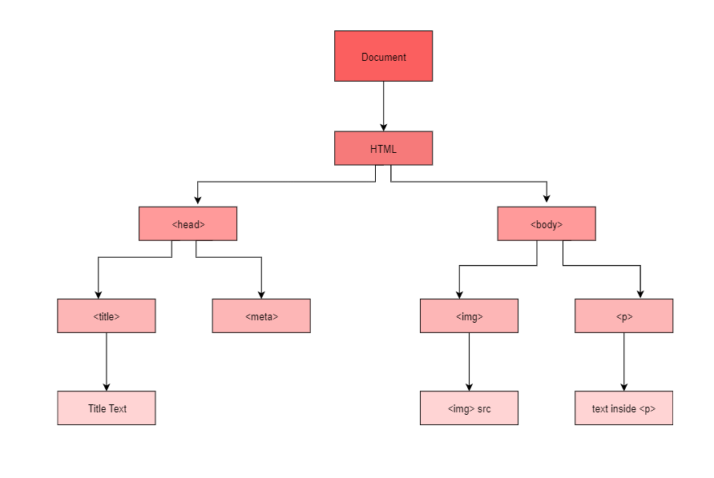
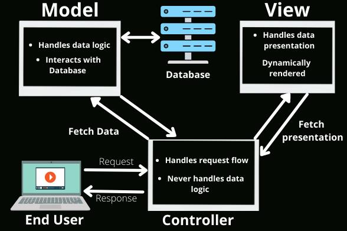

# Front-End-Interview
Languages
- [HTML](HTML/README.md)
- [CSS](CSS/README.md)
- [JavaScript](JavaScript/README.md)
  - [DOM: Document Object Model](#dom-document-object-model)
- [React](React/README.md)

Projects
- [Node.js Project](Node%20Project/README.md)
- [React Project](React%20Project/README.md)
- [Create React APP](CreateReactApp-CRA/chapter1/README.md)

Package Managers
- [NPM](#npm)
- [Yarn](#yarn)

Other Concepts
- [MVC: Model View Controller](#model-view-controller-mvc-framework)

---

## NPM
### Key software components for web development
We usually need three software components to get started with web development.

- **Code editor**
- **Web server:** You need a webserver to host sample pages. You can choose from a broad range of web servers, including Apache, Node.js, and IIS.
- **Browser**

### Installing and using Node.js using Node Package Manager (NPM) 
Node.js installs its own package management tool, npm (Node Package Manager).

The main role of this utility is to manage those Node.js packages and components your app or development process depend on.

It's a command-line tool that comes with Node.js and is used for managing packages of reusable JavaScript code. npm allows developers to install, share, and manage dependencies for their projects.

With npm, you can install packages from a central repository to your local machine. These packages contain reusable code, libraries, frameworks, etc

#### Global vs. Local Installation:
- **Global Installation:** When you install a package globally, it means that the package is installed in a central location on your machine, and it can be accessed by any Node.js application running on that machine.
- **Local Installation:** On the other hand, a local installation installs the package in a specific directory within your project. This means that the package is only available to that particular project.

#### package.json File
The package.json defines the start command that, as its name suggests, launches the web server and displays your page in the browser. The index.html file is the page that is rendered in the browser.

This is a metadata file for your project which lists the dependencies of your project along with other information such as the project's name, version, author, etc. When you install packages using npm, you can choose to save these dependencies into your project's package.json file. This file serves as a record of the dependencies required by your project.

Once you have a package.json file set up for your project, it becomes easy to manage dependencies. You can share your project with other developers, and they can simply run ```npm install``` to install all the dependencies listed in the package.json file. Additionally, npm can use this file to update dependencies to their latest versions or install any missing dependencies when needed.

## Yarn
Yarn is a package manager for JavaScript. Yarn was created to address some shortcomings of npm (Node Package Manager), the default package manager for Node.js, by improving performance, reliability, and security. Yarn offers simpler commands and <u>better caching</u> — and thus better performance.

We will use Yarn with React.

- **Dependency Management:** Similar to npm, Yarn helps manage dependencies for JavaScript projects. It allows developers to specify project dependencies in a ```package.json``` file and automatically installs the required packages along with their dependencies.
- **Reliability:** Yarn ensures consistent and reliable installations by using a lockfile (yarn.lock) to lock down the versions of dependencies. This helps prevent issues such as installing different versions of dependencies on different machines or in different environments.

## DOM: Document Object Model

The HTML DOM allows JavaScript to access and change any of the elements placed inside an HTML document.


### How does HTML page gets compiled ?
Right before showing the page, the browser must build up the structure of the page. This step generally starts by parsing the HTML source and ends with a structure of the page represented as a tree structure in the memory.

After having prepared this model in the memory, rendering engines utilize it to display the page according to the HTML standard.

## Model View Controller (MVC Framework)
Model-View-Controller (MVC) is a software architectural pattern commonly used for designing user interfaces and organizing code in applications. It divides an application into three interconnected components:



1. **Model:**   This is like the brain of the application. It holds all the data and rules about how that data can be used or changed. It's like a container for all the important information.  In an MVC architecture, the model notifies the view of any changes to the data, ensuring that the view always reflects the current state of the model. 
2. **View:** Think of this as the face of the application. It's what the user sees and interacts with. The view displays the data from the model in a way that's easy for the user to understand. It also lets the user input new data or make changes.
3. **Controller:** This is like the middleman between the model and the view. It handles user input and decides what to do with it. It talks to the model to get or change data, and it updates the view to show any new information.

### Popular MVC Frameworks:
Some of the most popular and extensively used MVC frameworks are listed below.

- Ruby on Rails
- Django 
- CherryPy 
- Spring MVC 
- Catalyst 
- Rails 
- Zend Framework 
- Fuel PHP 
- Laravel 
- Symphony