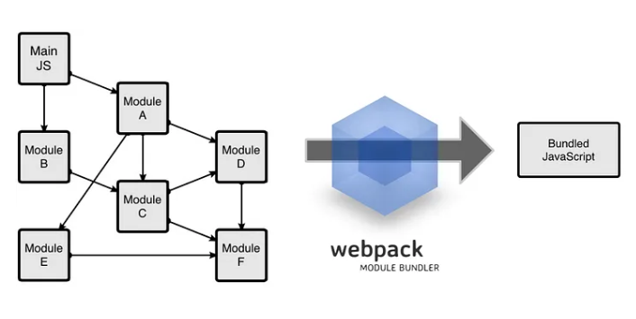

# React Project
- Install Yarn ```npm install --global yarn```
- Go to empty dir and run ```yarn init```
  - This will create package.json in that directory
    - The most common use of package.json files is to save a record of all of the packages we download and save into our project.
- To install Babel as devDependencies
  - **Babel** is usually only used as a dependency in React-based projects, namely as an npm package. Babel allows us to interpret and then transpile JavaScript that is not standardized or does not yet conform to standards supported by all modern browsers into code that can be executed without issues.
  - Babel consists of a core module (@babel/core) which offers a few APIs that plugins can use for each transpilation. These plugins are often grouped by presets. In turn, presets can install many plugins at once. In React, the most common presets are @babel/preset-react and @babel/present-env. The former is used to read and translate JSX. The latter transforms modern JavaScript based on its destination environment and translates it into something that even older browsers can understand.
  - Install the following dependencies ```yarn add babel-cli babel-loader babel-preset-env babel-preset-react -D```
  - Create and configure ```.babelrc``` by typing this in windows ```type NUL > .babelrc```
  - configure our .babelrcput the following codes inside it : 
  ```
  {
    "presets": ["env", "react"]
  }
  ```
- Install React:  ```yarn add react react-dom```
- Install Webpack as devDependencies
  - Webpack plays a central role in the React ecosystem, facilitating an efficient workflow that would otherwise be challenging to achieve. Essentially, it acts as a module bundler, allowing developers to organize their code into separate modules and efficiently manage dependencies, much like how modules work in Node.js.
  - Dependency Management: Webpack allows developers to declare dependencies between modules using import or require statements. This means that each module can specify which other modules it depends on, making it easier to understand and manage the codebase's structure.
  - Module Scope: When Webpack bundles the application, it ensures that each module's dependencies are loaded into its own module scope. This prevents conflicts between different modules and ensures that dependencies are encapsulated within their respective modules.
  - Webpack simplifies the React development process by providing a module-based approach to code organization and dependency management. 
  - To install webpack run ```yarn add webpack webpack-dev-server webpack-cli -D```
  - We use webpack to bundle all our javascript files into one file.

- Create build/index.html
- Create src/index.js
- Create webpack.config.js
  - Entry point: will be index.js in /src/ directory.
  - Output: is a generated file named index.bundle.js and will be generated in /build/ directory.
- Add Scripts in package.json
```yaml
"scripts": {
  "start": "webpack-dev-server --open",
  "build": "npm run clean && npm run compile",
  "clean": "rm -rf ./build/index.bundle.js",
  "compile": "NODE_ENV=production webpack --config ./webpack.config.js --progress"
},
```
  - start: will start webpack devserver and automatically open up localhost:3000 on your browser.
  - clean: will delete the generated index.bundle.js in /build/ directory
  - compile: webpack will compile and generate index.bundle.js in /build/ directory
  - build: will run the script clean then compile
- Finally run ```yarn start```
- If using linux you can run ```yarn build```
  - build is one of the scripts that we added in package.json earlier. Check out package.json for it. (it's not working for me at the moment but yarn start is working)


# Good reads
- [Set-up React Stack with Webpack](https://itnext.io/from-zero-to-deploy-set-up-react-stack-with-webpack-3-20b57d6cb8d7)